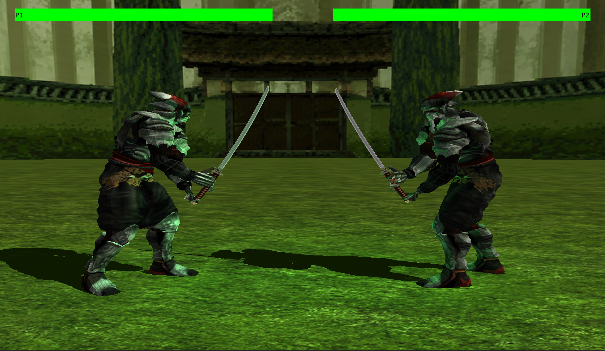
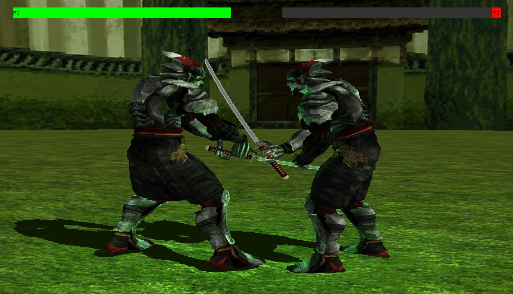
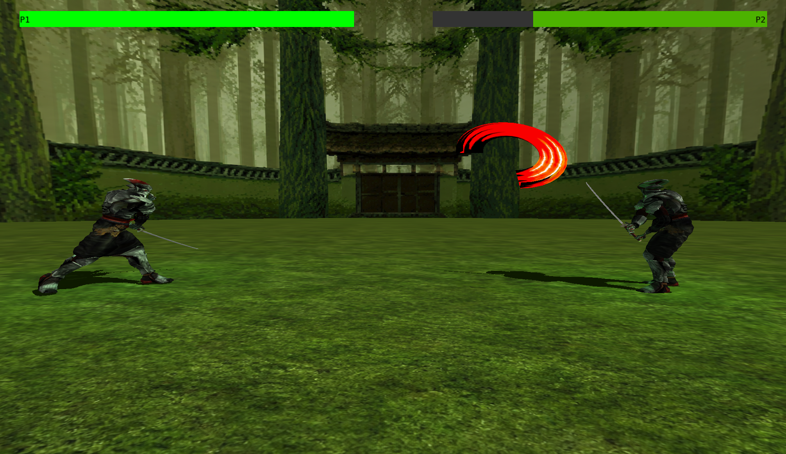

# Computação Gráfica e Visualização I (INF01047) - INF/UFRGS
Guilherme Hilgert Feroleto - 587076
Henrique Wermann da Silva - 588786

## Aplicação
Nosso trabalho é um jogo de luta baseado no jogo Tekken 3, lançado em 1997. No jogo é possível controlar um dos personagens e lutar contra o adversário. A batalha pode ocorrer tanto com a IA do oponente ligada quanto desligada. O personagem possui dois golpes, um ataque rápido e outro de projétil que se movimenta com base em curvas de bezier. As espadas dos personagens emitem uma luz verde que pode ser vista iluminando o chão e os personagens, principalmente peitoral e pernas.

## Contribuições para o trabalho

O aluno Henrique da Silva ficou responsável por implementar os aspectos da gameplay como o sistema de inputs, colisão, lógica de golpes e movimentação, câmeras, iluminação das espadas e a sombra dos personagens.
O aluno Guilherme Feroleto ficou responsável pela seleção/criação dos modelos 3D, do personagem, da espada e do skybox usado para o cenário; pela escolha do conjunto de animações e texturas; pela aplicação das animações no personagem e a aplicação das texturas, no personagem, na espada e no cenário; pelos elementos de hud da aplicação, como as barras de vida e a tela de fim de jogo, e também pela lógica de reínicio/congelamento quando a vida de algum dos personagens chega em zero.

## Uso de IA
Para realizar o trabalho utilizamos IAs como gemini, github Copilot e Claude. A parte onde elas foram usadas mais diretamente estão explicitadas no arquivo PROMPTS.md. Fora esses, a IA serviu como ferramenta para debugs eventuais e aprendizado sobre OpenGl e c++. O uso de Ia foi muito útil para estes casos, acelerando considervelmente o processo, porém ela não conseguiu nos ajudar para corrigir um bug que havia na câmera em que quando os personagens ficavam muito próximos ela invertia de lado. Neste caso foi tentado alternativas de correção, com diversas IAs, mas nehuma conseguiu ajudar, enquanto todo o problema era causado por somente uma linha do código que precisava ser retirada.

## Imagens





## Manual
- Teclas "AWSD" para movimentação do personagem.
- Tecla "I" para ataque rápido.
- Tecla "O" para o golpe de projétil.
- Tecla "1" para ligar e desligar a visualização das hitboxes.
- Tecla "2" na tela de fim de jogo para trocar o modo de câmera.
    - no modo de camera livre use as setas do teclado para movimentar nos eixos X e Z e use "0" e "9" para se mover no eixo Y.
- Tecla "3" para ligar e desligar a IA do adversário.

## Passos necessários para compilação e execução da aplicação (em ambiente windows - não testado em linux)

Primeiro é necessário ter a biblioteca Assimp instalada, se já tiver ignorar próximo passo

## Instalação da biblioteca Assimp

Se estiver usando UCRT64 com MSYS2, seguir os seguintes passos:

```bash
abrir o terminal MSYS2 UCRT64 e rodar o seguinte comando:
pacman -S mingw-w64-ucrt-x86_64-assimp

após instalar, rodar o comando:
find /ucrt64 -name "libassimp*"

deve aparecer algo como:
/ucrt64/bin/libassimp-6.dll
/ucrt64/lib/libassimp.dll.a
```

# Configuração do CMakeLists.txt

verificar o target_include_directories

```bash
target_include_directories(${EXECUTABLE_NAME} BEFORE PRIVATE 
    ${PROJECT_SOURCE_DIR}/include
    # caminho padrão do MSYS2 UCRT64
    C:/msys64/ucrt64/include
)

se a assimp tiver sido instalada em um local diferente de C:/msys64/ucrt64/include, adicionar o caminho dentro do target_include_directories
```

adicionar link da biblioteca em target_link_libraries

```bash
target_link_libraries(${EXECUTABLE_NAME} 
    ${LIBGLFW} 
    gdi32 
    opengl32
    C:/msys64/ucrt64/lib/libassimp.dll.a
)

se quando rodou o comando find /ucrt64 -name "libassimp*" o caminho foi diferente de "/ucrt64/lib/libassimp.dll.a", adicionar o caminho completo dentro do target_link_libraries
```

# Criação do arquivo .vscode/c_cpp_properties.json

caso esteja dando problema nos includes das bibliotecas do assimp, criar um arquivo chamado c_cpp_properties_json dentro da pasta .vscode com o seguinte conteúdo:

```json
{
    "configurations": [
        {
            "name": "Win32",
            "includePath": [
                "${workspaceFolder}/include",
                "C:/msys64/ucrt64/include",
                "C:/msys64/ucrt64/include/assimp",
                "${workspaceFolder}/include/glad",
                "${workspaceFolder}/include/GLFW",
                "${workspaceFolder}/include/glm",
                "${workspaceFolder}/include/KHR"
            ],
            "defines": [
                "_DEBUG",
                "UNICODE",
                "_UNICODE"
            ],
            "windowsSdkVersion": "10.0.20348.0",
            "compilerPath": "C:/msys64/ucrt64/bin/g++.exe",
            "cStandard": "c17",
            "cppStandard": "c++11",
            "intelliSenseMode": "gcc-x64"
        }
    ],
    "version": 4
}
```

## Depois da instalação e configuração da Assimp

Depois de concluir a configuração da biblioteca Assimp, deve ser possível compilar e rodar o programa sem problemas, sendo possível executar diretamente pelo botão de launch no canto inferior esquerdo do vscode